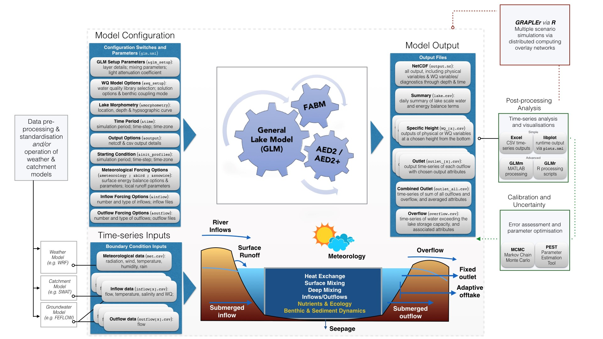
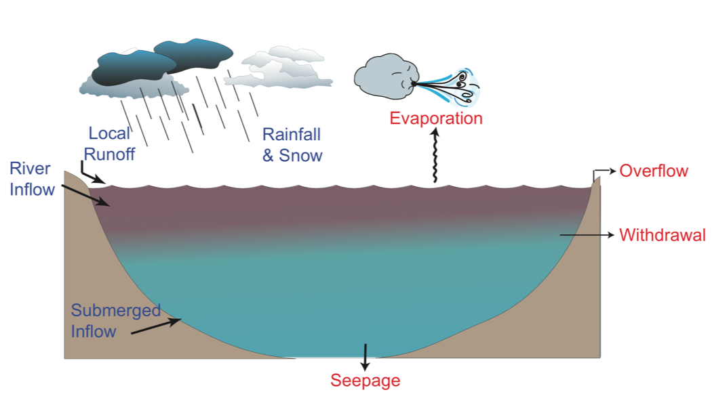

# Module 1: Getting Started with GLM {#C02_1 -}

### Module Resources {#C02_2 -} 

Download the GLM files for this module by clicking the download button in the tool bar <i class="fa fa-download" aria-hidden="true"></i>.

### Setting up GLM {#C02_3 -}

#### Running GLM on MacOS {#C02_4 -}

- Open the Terminal application on your Mac
- Use the `cd` (change directory) command to navigate to the *Kinneret97* folder
- In Finder, go to the macGLM folder and right-click on the glm app, select *Show Package Contents*
- Enter the Contents folder then the MacOS folder, and locate the glm executable file
- Back in terminal, enter the file path for this executable file - you can do this by dragging/dropping the file into the terminal
- Leave a space after the file path and type `--xdisp`
- Press Enter and the model will open

<center>
<video width="100%" height="100%" controls>
  <source src="images/09-module8/video1.mp4" type="video/mp4">
</video>
</center>

```{block2, hint02_1, type='rmdnote2'}
Your Mac may block opening GLM the first time you run it. If this occurs, go to your Security options inside System Preferences and click 'Open Anyway'.
```

#### Running GLM on Windows {#C02_5 -}

On Windows, the model can be run using a batch-file `glm.bat`, which you can double click from in the *Kinneret97* directory. The `.bat` file calls the GLM model from the current working directory.

```{block2, hint02_2, type='rmdnote2'}

If the model is not opening make sure you're **not** working in a network directory (e.g. OneDrive) and the file path to the `glm.bat` file has **zero** spaces in it.

```

<!-- #### Running GLM in RStudio {#C02_6 -} -->

<!-- If you want to use RStudio, open the R Project, then each of the R files: `Get started.R`, `Change parameters.R` and `Plot.R`. Run the lines in `Get started.R` - it will download all the R packages from the internet, as well as an old version of GLM.  -->

<!-- To get the latest version of GLM, paste the *winGLM* folder into the place where R has saved its old version of *winGLM*, for example, `H:/My Documents/R/win-library/3.4/GLMr/extbin/winGLM`. After that you can drive the model and plot everything using the other two scripts. -->

<!-- ```{block2, hint02_3, type='rmdnote2'} -->
<!-- GLM will not run on any versions of R newer than 4.0 -->
<!-- ``` -->

### Anatomy of a Simulation {#C02_7 -}

<center>
```{r pic02-3, echo=FALSE, fig.cap="Schematic diagram of water balance components.", out.width = '85%'}

```
</center>

Once the model has run, you can inspect the results. There are three ways to look at the output:

- Via the time-depth contour plots that appear during the run (configured via `plots.nml`)
- Further information on the daily water and energy balance is in the output file `lake.csv`
- Time series values of selected state variables (e.g. temperature, salinity, etc...) can be requested for a specific depth (depth above bottom) – this is setup in `&outputs` (eg. `WQ_5.csv`)

### Exercise: Lake-scale Water & Heat Balance {#C02_8 -}

The simulation in the *Kinneret97* directory is an example 40m deep, monomictic lake that is used to supply drinking water and support an active fishery.

Before running the model, open the file `glm3.nml` in a text editor and inspect the model setup etc. This file is the main configuration file that drives the model. The file `glm3.nml` has several key sections in it related to the model domain and parameters, the sources of boundary condition data, and details of outputs. Scan the parameters, e.g. number of layers, light extinction coefficient, mixing coefficient etc.

1) Draw a schematic picture of the lake, the relevant boundary conditions (both related to water
fluxes and energy fluxes).
2) Identify and open the boundary condition input files - these are csv files containing time-series of meteorological information, and inflow and outflow volumes. These files can be opened in Excel or a text-editor. Find where these files are called from within `glm3.nml`.
3) Plot the lake water balance – volume, water level and fluxes including inflows, outflows, rainfall and evaporation (refer to columns in `lake.csv`, and copy the appropriate data into your own excel spreadsheet).

<center>
```{r pic02-4, echo=FALSE, fig.cap="Schematic diagram of water balance components.", out.width = '75%'}

```
</center>

4) Plot the surface heat fluxes such as shortwave, longwave, sensible heat latent heat (refer to columns in `lake.csv`).

<center>
```{r pic02-5, echo=FALSE, fig.cap="Schematic diagram of surface heat fluxes impacting lake water temperature. For a description of the heat flux terms refer to the [GLM paper](https://gmd.copernicus.org/articles/12/473/2019/)", out.width = '75%'}
knitr::include_graphics("images/09-module8/picture3.png")
```
</center>