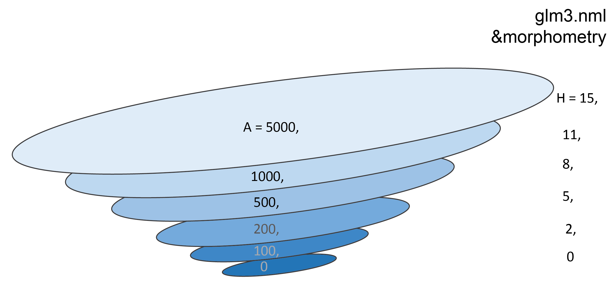
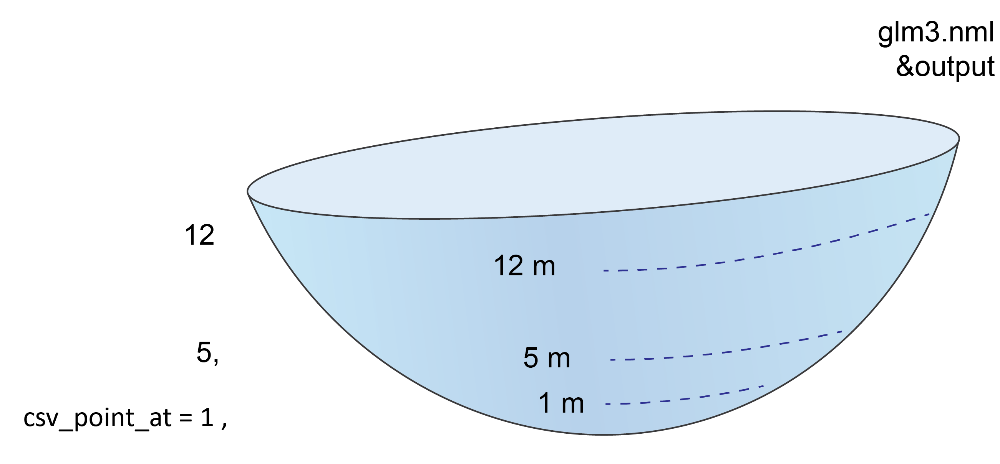
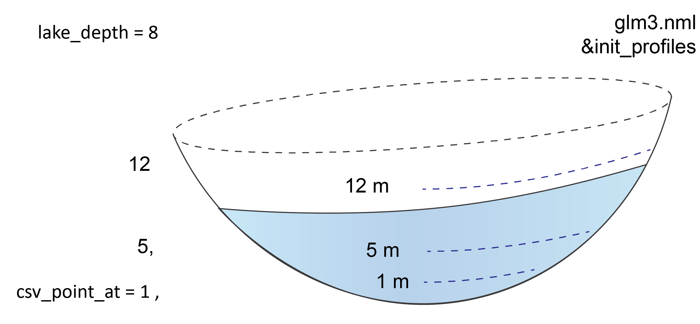
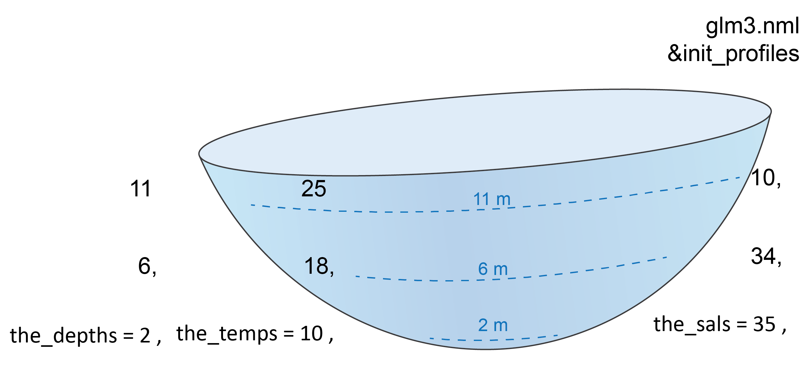
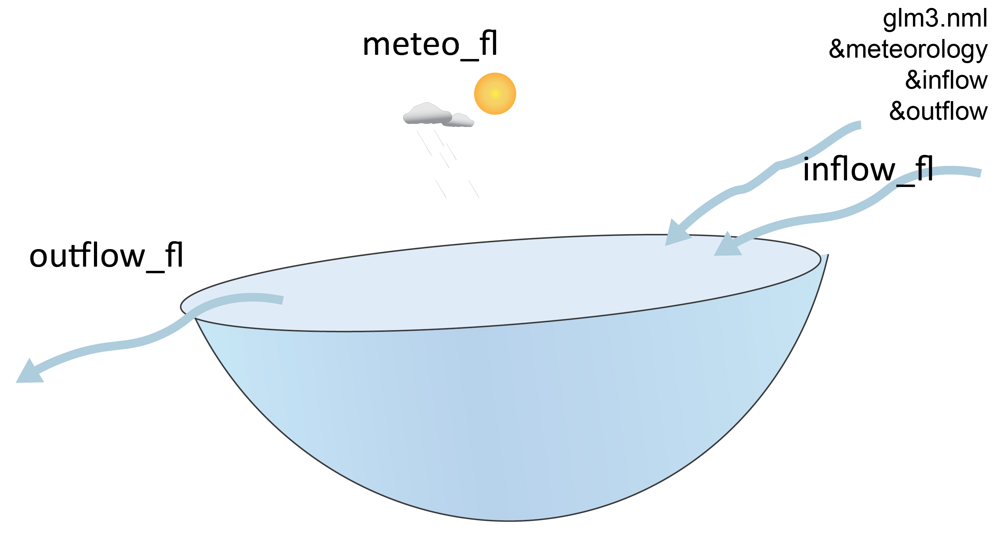
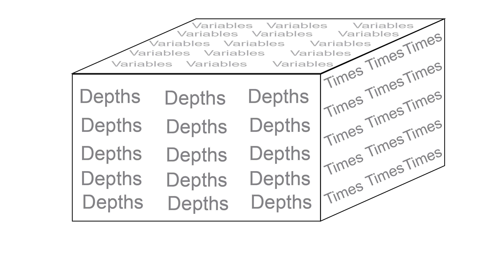

# GLM File Structure {#glm-file-structure -}
## GLM input files {-}

### GLM configuration file: `glm3.nml`{-}

A GLM model simulation is controlled through the main configuration file : glm3.nml.

The key elements of this file are depicted as 'blocks' and each block of configuration options and parameters is summarised in detail on [this page](https://aquatic.science.uwa.edu.au/research/models/GLM/configuration.html). Each block is started with an ampersand `&` and finished with a slash `/`. The blocks contain text that can be either 
-   single parameters (with units)\
-   listed parameters, for example, for every depth layer or every river inflow \
-   listed variables, for example, variables to be read in or written to the output\
-   file paths and file names\
-   configuration switches (integers or logical values)\

Some key inputs for setting up a GLM simulation are listed below.

`&wq_setup`:`wq_lib` sets an external water quality model, for example, 'aed'.\
`&wq_setup`:`wq_nml_file` is the filepath and filename for an external water quality model namelist.\

`&glm_morphometry`:`H` is a list of some of the heights of the lake.\
`&glm_morphometry`:`A` is a list of some of the areas of the lake, at the same layers listed in `H`.


<center>
```{r pic02-1, echo=FALSE, fig.cap="", out.width = '75%'}

```
</center>


`&time`:`timefmt` is a switch for the time setup: either number of days (= 3) or start and stop days (= 2).\
`&time`:`start` and `stop` are the dates to start and stop (`timefmt` = 2).\
`&time`:`num_days` is the number of days for a simulation (`timefmt` = 3).\

<center>
```{r pic02-2, echo=FALSE, fig.cap="", out.width = '75%'}

```
</center>

`&output`:`csv_point_nlevs` is the number of `csv_point_at` depths to use, as listed left to right.\
`&output`:`csv_point_at` is a list of the depths (m) from the bottom at which an output csv file is written.\
`&output`:`csv_point_vars` is a list of the simulated variables to write to the output csv.\
`&output`:`csv_point_nvars` is the number of `csv_point_vars` to use, as listed left to right.\

```{block2, hint02_1, type='rmdtip2'}
If a `csv_point_at` depth is listed but it is greater than the initial depth of the lake, no initial value can be written and the model will not work.
```
<center>
```{r pic02-3, echo=FALSE, fig.cap="", out.width = '75%'}

```
</center>


`&init_profiles`:`num_depths` is the number (integer) of depths to set for the initial profile.\
`&init_profiles`:`the_depths` are the depths (m) of the initial profiles, where other features are configured, from bottom to top.\
`&init_profiles`:`the_temps` are the initial temperatures at `the_depths`.\
`&init_profiles`:`the_sals` are the initial salinity at `the_depths`.\

<center>
```{r pic02-4, echo=FALSE, fig.cap="", out.width = '75%'}

```
</center>

`&inflow`:`num_inflows` is a number (integer) of inflowing streams.\
`&inflow`:`inflow_fl` is a list of the file names for the inflowing streams.\
`&inflow`:`inflow_vars` is a list of variables to be taken from the inflow files.\

`&outflow`:`num_outlet` is a number (integer) of outflowing streams.\
`&outflow`:`outflow_fl` is a list of the file names for the outflowing streams.\
`&outflow`:`outflow_fl` is a list of the file names for the outflowing streams.\

<!-- `&sediment`:`zone_heights` is a list of the heights (m) of the sediment zones, from bottom to top.\ -->

<center>
```{r pic02-5, echo=FALSE, fig.cap="", out.width = '75%'}

```
</center>

### GLM plot window file: `plots.nml`{-}

The `plots.nml` text file configures the automatic plot window that runs during the simulation. The x axis is time, the y axis is lake depth layer and the z axis (colour bar) is the scale of the variable, for example concentration. The user can configure the plot window using the following:
-   `&plots_window`:`width` and `height` set the dimensions of the plotting window (mm).\
-   `&plots`:`plot_width` and `plot_height` set the dimensions of the individual plots (mm).\
-   `&plots`:`title` is a list of the titles displayed above each plot.\
-   `&plots`:`vars` is a list of the GLM or AED variables for each plot, in the same sequence as `title`.\
-   `&plots`:`min_z` and `max_z` set the minimum and maximum values for each of the variables, in the same sequence as `title`.


### Boundary files{-}
Boundary .csv files can be found in the 'inputs' directory. The exact names and paths are listed in the glm3.nml block `&inflow`, `&outflow` and `&meteorology`.

#### Inflow files{-}
The simulated lake may have streams or rivers flowing into it. If so, one time series boundary .csv file is used for each inflow stream. The rows of the csv are time steps and the columns are inflowing variables, such as flow volume, salinity and oxygen. The file names are listed in `inflow_fl` and the model will read them in from left to right according to the number set in `num_inflows`.

#### Outflow files{-}
In a similar way to the inflow files, the simulated lake may have streams or rivers flowing out of it. If so, one time series boundary .csv file is used for each outflow stream. The rows of the csv are time steps and the columns are outflowing variables, such as flow volume, salinity and oxygen. The file names are listed in `outflow_fl` and the model will read them in from left to right according to the number set in `num_outlet`.


#### Meteorological file{-}
One meteorological file sets conditions at the surface of the lake, i.e. the water-atmosphere boundary. It includes values such as air temperature, wind speed and light. The file is also a time-series boundary, with rows as time steps and columns as each boundary variable. It often has a name like 'met.csv'. 

<center>
```{r pic02-6, echo=FALSE, fig.cap="", out.width = '50%'}

```
</center>


### AED water quality model files{-}
If an external water quality model is being used, it will be specified with the parameter `&wq_setup`: `wq_lib`, for example, 'aed'. The parameters for the water quality model are specified by a file and file path in `wq_nml_file`, for example, 'aed/aed.nml'. 


## GLM output files{-}

Once GLM is running, it will write its results to several different output files.

### Output Netcdf{-}
The results of all variables at all time steps and depths are written to the netcdf file. This file may have a size of hundreds of MB or GB. The file can be accessed with Matlab or R packages that have been created to organize these large file types. 

<center>
```{r pic02-7, echo=FALSE, fig.cap="", out.width = '33%'}

```
</center>

### General lake csv{-}
One csv is written for each simulation. The file name is set with the parameter `&output`: `csv_lake_fname`, for example 'lake.csv'.
This file contains values that apply to the whole lake, such as lake volume, lake level and surface temperature.

```{block2, hint02_2, type='rmdtip2'}
If this file is open in a program such as Excel, the GLM program cannot overwrite the file. Close the .csv or save it with a different file name before running the model again.  
```

### Depth-specific .csv{-}
Profiles can be output at specified depths, using `&output`: `csv_point_fname` and `csv_point_at`. For example, if `csv_point_fname` is 'WQ' and `csv_point_at` is 1, 5, 12, then the model will create files 'WQ_1', 'WQ_5' and 'WQ_12'. The variables for this file are listed in the parameter `csv_point_vars`. This file can be used to access output data at one depth more easily than via the netcdf file.
