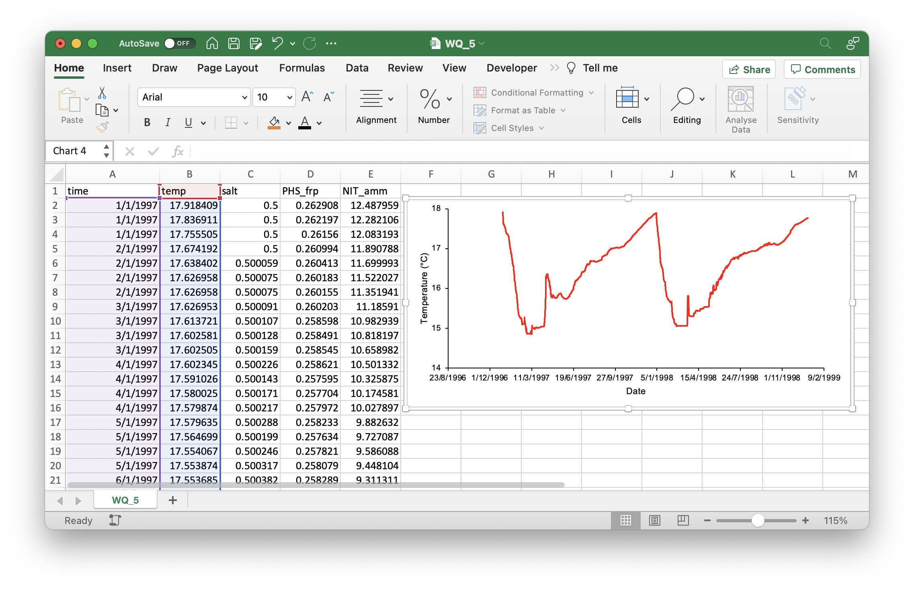

# Processing Outputs {#processing-outputs -}


## Visualising Results {-}

Depending on your preference for visualisation software, both Excel and R can be used for the plotting of GLM's general lake or depth-specific csv outputs. R is required for visualising NetCDF outputs. 

### Excel {-}

```{r pic04-1, echo=FALSE, fig.cap="", out.width = '100%'}

```

### R {-}

```{r echo=TRUE, message=FALSE, warning=FALSE}
# Load packages
library(tidyverse) 
library(lubridate)

read_csv("plots/processing-outputs/WQ_5.csv") %>%  # Read GLM csv
  mutate(
    time = as_datetime(time, format = "%Y-%m-%d %H:%M:%S") # Format date/time
  ) %>% 
  ggplot(mapping = aes(x = time, y = temp)) + # Plot with ggplot()
  geom_line(colour = 'red') +
  labs(x = "Date", y = "Temperature (°C)") +
  theme_classic()
  
```