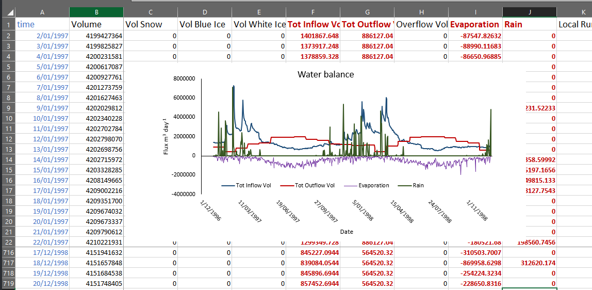
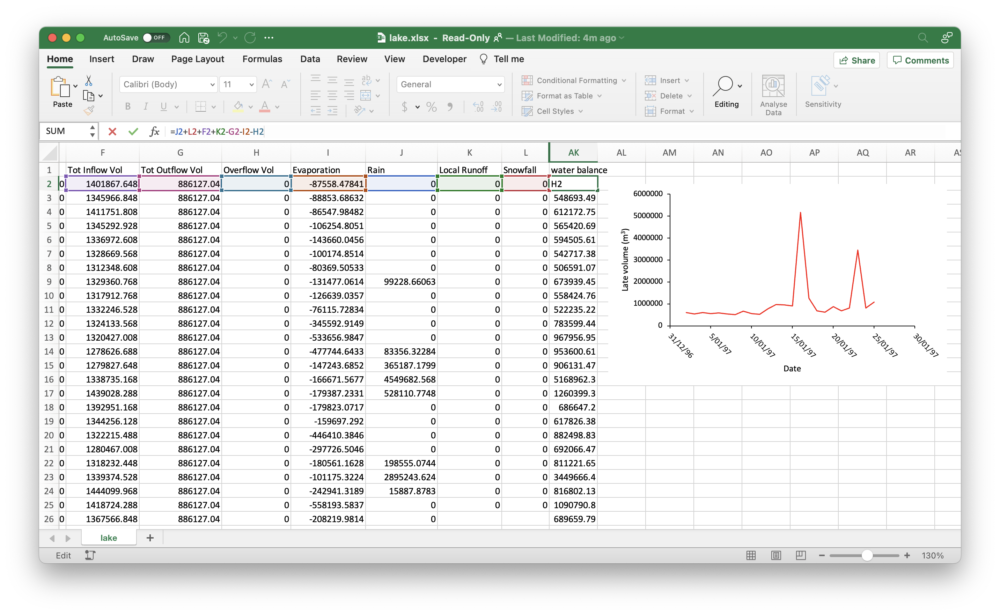

# (PART) Case Study Exercises {-}

# Water Level & Balance { #WaterBalance}

The water balance is the sum of all water entering and leaving the lake (equation \@ref(eq:watbal-1)). 

```{=tex}
\begin{eqnarray}
\frac{\Delta Storage}{\Delta time} = Rainfall + Snow + Local \ \ runoff + River \ \ inflow
\\
- Evaporation - Withdrawal - Overflow - Seepage
(\#eq:watbal-1)
\end{eqnarray}
```

<br>

```{r picex1-1, echo=FALSE, fig.cap="", out.width = c('40%','10%','40%')}
knitr::include_graphics(c("images/02-files/GLMworkbook-09.png","images/Spacer.png","images/02-files/GLMworkbook-10.png"))
```

The `lake.csv` file can be used to calculate the change in water storage over the course of the simulation. Copy the water balance columns from `lake.csv` to your own spreadsheet. Calculate the total water balance in a new column. You can find the list of the variables [on this page](https://github.com/AquaticEcoDynamics/glm-aed/wiki/Navigating-GLM-outputs).


Plot the lake water balance -- volume, water level and fluxes including inflows, outflows, rainfall and evaporation.

<br>

Examining components of the water balance:
```{r picex1-3, echo=FALSE, fig.cap="", out.width = '100%'}

```
<br>

Computing the daily surplus or deficit:

```{r picex1-2, echo=FALSE, fig.cap="", out.width = '100%'}

```


Remember to label all the variables and units that you plot. Close the `lake.csv` file before you run the model again.
