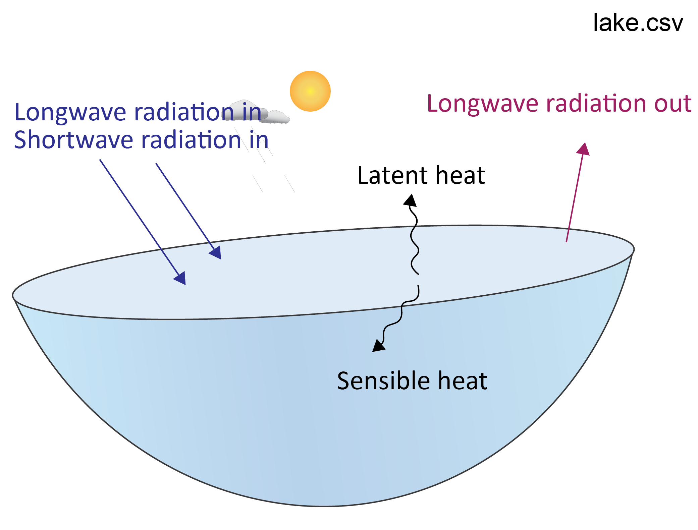
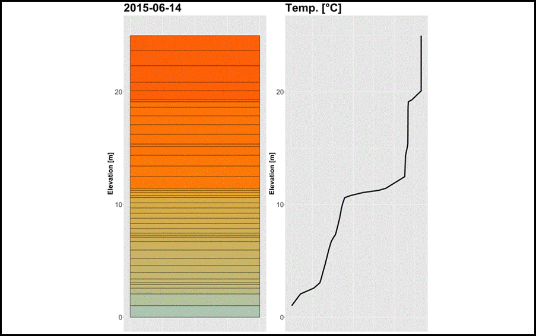

# Water Heating & Stratification { #WaterHeatingAndStratification}

The energy balance is the sum of all energy entering and leaving the lake (equation \@ref(eq:enbal-1)). 

```{=tex}
\begin{eqnarray}
\frac{\Delta Energy}{\Delta time} = + φSW  + φH + φLW - φE
(\#eq:enbal-1)
\end{eqnarray}
```

where $φSW$ is the flux of shortwave radiation into the lake. In the `lake.csv` file, this appears as `Daily Qsw`. $φH$ is the sensible heat flux (`Daily Qh`). $φLW$ is the sum of longwave radiation into and out of the lake (`Daily Qlw`). $φE$ is the latent heat flux (`Daily Qe`).

<center>
```{r picex2-1, echo=FALSE, fig.cap="", out.width = '50%'}

```
</center>

<center>
```{r picex2-2, echo=FALSE, fig.cap="", out.width = '50%'}

```
</center>


Copy the data from `lake.csv` to a new spreadsheet. Plot the surface heat fluxes and the total energy balance over time.

A lake is 'stratified' if it has a large difference between the top and bottom for a variable such as temperature or salinity. A seasonal weather pattern may break the stratification. Use the GLM plotting window to examine whether you lake is stratified. Do you see any seasonal patterns in the temperature differences between the top and the bottom? Is this reflected in any variables other than temperature?

Go to the `&output` (not `&outflow`!) section of `glm3.nml` and customize the configuration to make two output files, one at 5 m from the bottom (ie. in the lake hypolimnion) and one at 35 m from the bottom (i.e. in the lake epilimnion). Use the parameter `csv_point_at` to set the depths, from the bottom, at which the model will write .csv files. This creates two `.csv` files (`WQ_5.csv` and `WQ_35.csv`) with conditions at these water depths. 

``` {fortran, eval = FALSE, style="max-height: 239px;"}
!-------------------------------------------------------------------------------
! format for output and filename(s)
!-------------------------------------------------------------------------------
&output
   out_dir = 'output'
   out_fn  = 'output'
   nsave = 6  !This will output every 6 hours
   ! General summary file
   csv_lake_fname = 'lake'
   ! Depth specific outputs
   csv_point_nlevs = 2 
   csv_point_fname = 'WQ_'
   csv_point_at = 5.,35.
   csv_point_nvars = 4
   csv_point_vars = 'temp','salt','PHS_frp','NIT_amm'
/
```

Save the `glm3.nml` and run the model again.

Find the new output .csv files in the `output` folder. Copy the data to a new Excel spreadsheet.  Calculate the temperature difference between the top and the bottom. Identify the periods where the lake is stratified and mixed.

```{block2, hintex2_1, type='rmdtip2'}
If an output  file is open in Excel, the GLM program cannot overwrite the file. Close the .csv or save it with a different file name before running the model again.  
```
