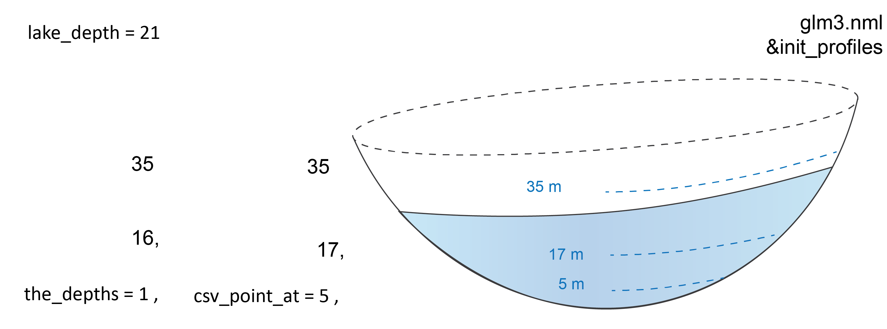

# Updating Initial Height Conditions

The height of the water in the lake at the first time step is set in `&init_profiles`: `lake_depth`. Consider this: what would happen if all the environmental boundary conditions were the same, but the initial storage were half as much? Decrease your `lake_depth` to 50% of the value you started with. 

Examine the results in the GLM plotting window and compare them to the original simulation.

Create an output profile just below the surface. For example, if your initial height is 21 m, create `csv_point_at` files at 5 m and 18 m from the bottom. Calculate the temperature difference between the top and the bottom, as in the previous exercise.

Describe the effect on stratification of having a shallower lake. 


```{block2, hintex3_1, type='rmdtip2'}
If a `csv_point_at` depth is listed but it is greater than the initial depth of the lake, no initial value can be written and the model will not work.
```
<center>
```{r pic02-3, echo=FALSE, fig.cap="", out.width = '75%'}

```
</center>
