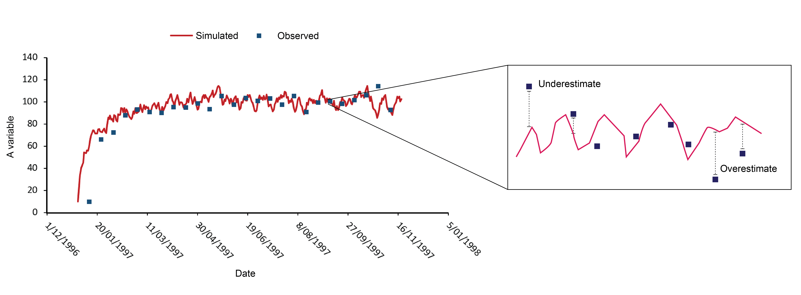

# Error Assessment {#error-assessment}

## Mean Absolute Error (MAE) {-}

Mean absolute error measures the average absolute difference between the simulated and the observed results. It is calculated by summing the absolute error between paired values (i.e. modelled and actual) and dividing by the number of observations:

<center>
\begin{equation}
MAE = \frac{\sum_{i}\left | T_{i}^{sim}-T_{i}^{obs} \right |}{n}
(\#eq:ex4-1)
\end{equation}

<br>

```{r picex4-1, echo=FALSE, fig.cap="", out.width = '100%'}

```
</center>

<br>

Calculate the mean absolute error in the simulation for the lake surface temperature (`Surface Temp` in `lake.csv`), comparing it to a dataset of observed temperature data for the same time period (`data/ObservedTempData.csv`). In Excel, in a new column, calculate the absolute difference between daily simulated and observed lake temperature for each time step (each row), then calculate the overall average of these differences.
