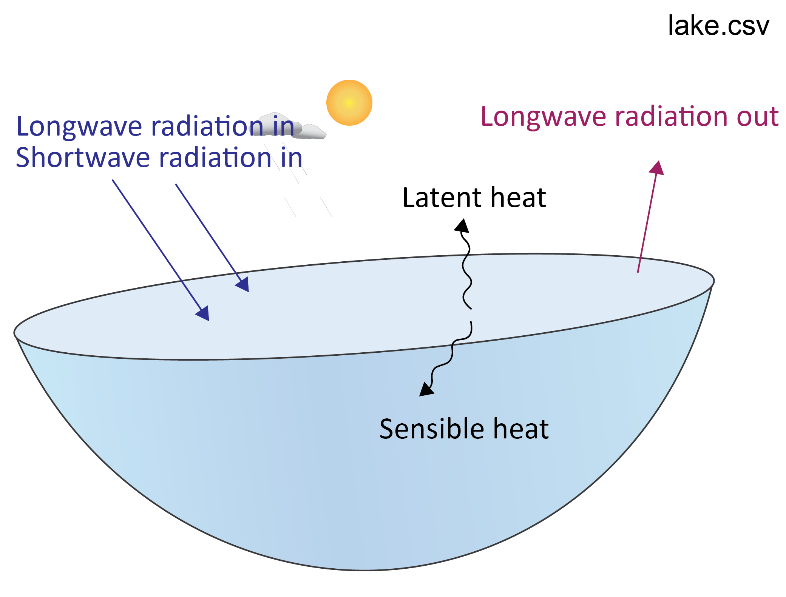

# Water Heating & Stratification { #WaterHeatingAndStratification}

## Energy Balance

The energy balance is the sum of all energy entering and leaving the lake (Equation \@ref(eq:enbal-1)). 

```{=tex}
\begin{eqnarray}
\frac{\Delta Energy}{\Delta time} = + φ_{SW}  + φ_{H} + φ_{LW} + φ_{E}
(\#eq:enbal-1)
\end{eqnarray}
```

where $φSW$ is the flux of shortwave radiation into the lake and all units are in W m^-2^. In the `lake.csv` file, this appears as `Daily Qsw`. $φH$ is the sensible heat flux (`Daily Qh`). $φLW$ is the sum of longwave radiation into and out of the lake (`Daily Qlw`). $φE$ is the latent heat flux (`Daily Qe`). The output `lake.csv` file calculates whether these are positive (energy gains into the lake) or negative (energy losses from the lake) and will display these as positive or negative, respectively.

<center>
```{r picex2-1, echo=FALSE, fig.cap="", out.width = '50%'}

```
</center>

<br>

Save the data in `lake.csv` as a new xls spreadsheet. Plot the surface heat fluxes and the total energy balance over time. Set the axes so that the incoming energy fluxes are positive and outgoing are negative; a stacked area plot is often a useful way to summarise.

<br>

## Lake Stratification 


A lake is 'stratified' if it has a large difference between the top and bottom for a variable such as temperature or salinity. Stratification is usually created by sunlight making surface water warm and buoyant. Wind events and prolonged periods of surface cooling lead to mixing and can break the stratification. GLM uses many layers to resolve the vertical temperature and salinity profiles over the water column depth.

<center>

<video width="60%" height="100%" controls>
<source src="images/Exercises/layer_animation.mp4" type="video/mp4">
</video>

</center>


Inspect the depth-time contour plots in the GLM plotting window to examine the nature of stratification in the case study simulation(s). Do you see any seasonal patterns in the temperature differences between the top and the bottom? Is this reflected in any variables other than temperature?

*Outputing variables at multiple depths*: We can configure GLM to look in more depth the nature of differences between the upper and lower layers. Go to the `&output` (not `&outflow`!) section of `glm3.nml` and customize the configuration to make two *depth-specific* output files, one at 5 m from the bottom (ie. in the lake hypolimnion) and one at 35 m from the bottom (i.e. in the lake epilimnion). Use the parameter `csv_point_at` to set the depths, from the bottom, at which the model will write .csv files. This will create two `.csv` files (`WQ_5.csv` and `WQ_35.csv`) with conditions at these water depths. Make sure number of levels that you output (`csv_point_nlevs`) is set to the number of output .csvs that you want.

<br>

``` {fortran, eval = FALSE, style="max-height: 239px;"}
!-------------------------------------------------------------------------------
! format for output and filename(s)
!-------------------------------------------------------------------------------
&output
   out_dir = 'output'
   out_fn  = 'output'
   nsave   = 24                      ! This will output every 24 hours
  !- General summary file
   csv_lake_fname  = 'lake'
  !- Depth specific outputs
   csv_point_nlevs = 2               ! # of depth-specific output files
   csv_point_fname = 'WQ_'           ! prefix for files
   csv_point_at    = 5.,35.          ! depths (above bottom) for output
   csv_point_nvars = 4               ! number of columns to write
   csv_point_vars  = 'temp','salt','PHS_frp','NIT_amm'
/
```

<br>

Save the `glm3.nml` and run the model again.

Find the new output `.csv` files in the `output` folder. Copy the data to a new Excel spreadsheet.  Calculate the temperature difference between the top and the bottom. Identify the time periods where the lake is stratified and mixed.

<br>

```{block2, hintex2_1, type='rmdtip2'}
If an output  file is open in Excel, the GLM program cannot overwrite the file. Close the .csv or save it with a different file name before running the model again.  
```
