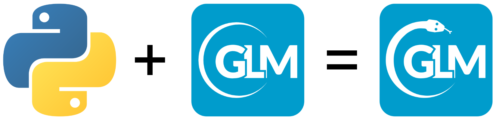

# Bonus exercise: GLM + Python

<center>
```{r glmpy-exercise, echo=FALSE, fig.cap="", out.width = '75%'}

```
</center>

<br>

The glm-py package extends GLM into the Python programming ecosystem. You can run a short exercise in your browser [here](https://colab.research.google.com/drive/18F702WfbOBQMr3g0sq-kpmsKqhqlvXhb?usp=sharing) that will introduce you to the package. Note, you will need a Google account to access the Colab runtime.