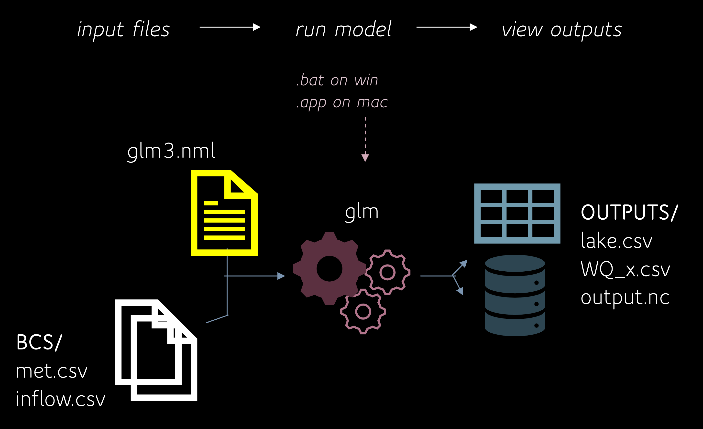
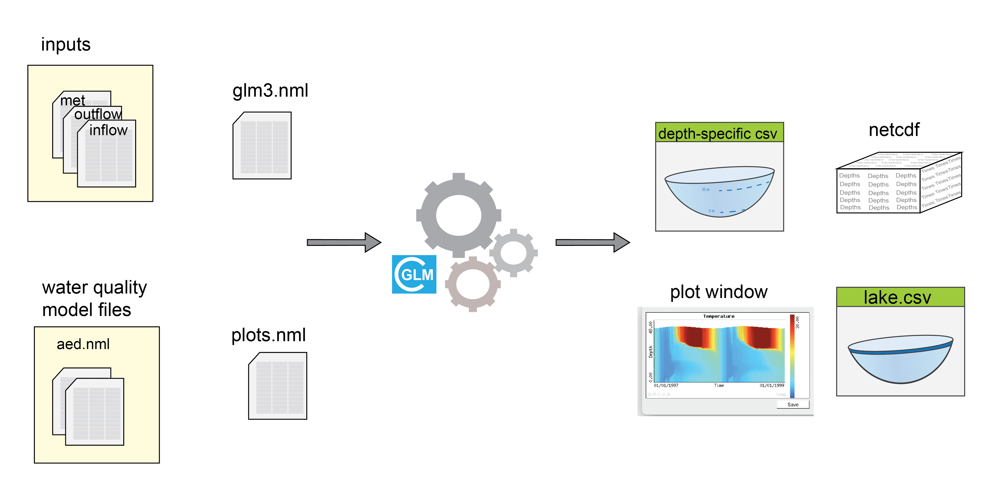
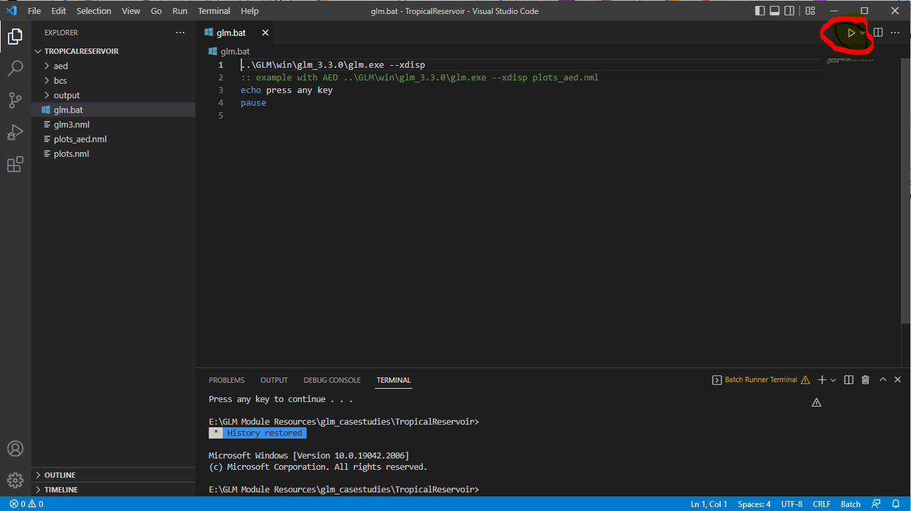

# Running GLM {#running-glm -}

## Simulation workflow {#C02_4 -}

<center>

```{r picrun-1, echo=FALSE, fig.cap="", out.width = '100%'}
# 

```

</center>

## Running GLM (Suggested Method) {#draft -}

### Install Visual Studio Code {-}

Visual Studio Code (VSC) is a convenient tool for editing and running GLM in an integrated environment. Begin by downloading VSC [here](https://code.visualstudio.com/).

### Open the WarmLake Directory in VSC {-}

Launch VSC and click the _Explorer_ button then _Open Folder_. Next, navigate to the _WarmLake_ directory and click _Open_.

<center>
<video width="100%" height="100%" controls>
  <source src="images/09-module8/openDirectory.mp4" type="video/mp4">
</video>
</center>

### Enable Syntax Highlighting and Open a `.nml` File {-}

GLM's WarmLake simulation can be configured by editing it's `.nml` text files in VSC. For better legibility when editing a `.nml`, enable Fortran syntax highlighting. Click on the _Extensions_ button and search for the _Fortran_ extension to install. Once installed, click on the _Explorer_ button again and open the `glm3.nml` file. In the bottom right-hand corner, click on _Plain Text_ and search for _Fortran - Modern_.

<center>
<video width="100%" height="100%" controls>
  <source src="images/09-module8/syntax.mp4" type="video/mp4">
</video>
</center>

### Run GLM {-}

To launch GLM, first open a new terminal session from VSC's menu bar. Depending on your operating system, the commands to run the simulation will differ:

::::: {.panelset}

::: {.panel}
[MacOS/Linux]{.panel-name -}

1. Begin by typing `chmod +x run_glm.sh` in the terminal and press _Enter_. This will enable executable permissions for the shell script that launches GLM.

```{block2, chmodTip, type='rmdnote2'}
You only need to run `chmod +x run_glm.sh` once! Subsequent launches of GLM will not require this command to be executed.
```

2. Next, run the GLM shell script by entering `sh run_glm.sh` into the terminal prompt.

3. You'll then be prompted to select which GLM plotting script will be used to visualise the model's outputs as it runs. Enter `1` and the simulation will launch with the basic visualisation configuration (temperature and salinity).

```{block2, hint03_9, type='rmdnote2'}
Your Mac may block opening GLM the first time you run it. If this occurs, go to your Security options inside System Preferences and click 'Open Anyway'. Then re-run `sh run_glm.sh` in VSC's terminal.
```

4. Once the simulation has finished, click _Done_ and return to the terminal to either re-run the model or quit (option `4`).

```{r panelsetVid, echo=FALSE, message=FALSE, warning=FALSE}
htmltools::tags$video(
  width='100%',
  controls=NA,
  htmltools::tags$source(
    src='images/09-module8/run_chmod.mp4',
    type="video/mp4"
  )
  )
```

:::

::: {.panel}
[Windows]{.panel-name -}

1. Open a new terminal.

2. Next, run the GLM script by entering `.\run_glm.bat` into the terminal prompt.

3. Once the simulation has finished, click _Done_ and return to the terminal to either re-run the model or quit.

```{r panelsetVidWin, echo=FALSE, message=FALSE, warning=FALSE}
htmltools::tags$video(
  width='100%',
  controls=NA,
  htmltools::tags$source(
    src='images/09-module8/run_glm_windows_v2.mp4',
    type="video/mp4"
  )
  )
```

:::

:::::

## Running GLM (Alternative Method) {-}

### Running GLM on Windows {#C02_5 -}

On Windows, the model can be run by double-clicking the batch-file `run_glm.bat`, which you can open from in the simulation directory (e.g. _warmlake_ folder). The `.bat` file calls the GLM model from the current working directory, and should be located where the `glm.nml' file is.

```{fortran, eval = FALSE, style="max-height: 239px;"}
..\GLM\win\glm_3.3.0\glm.exe --xdisp
echo press any key
pause
```

```{block2, hint03_2, type='rmdnote2'}

If the model is not opening make sure that you are **not** working from a network directory (e.g. OneDrive) and the file path to the `run_glm.bat` file has **zero** spaces in it.

```

<br>

### Running and editing GLM with Visual Studio Code _Batch Runner_ extenstion on windows {#C02_5 -}

- Click 'Extensions' on left panel, search 'Batch Runner'
- Install the _Batch Runner_ extenstion
- Open the GLM case study folder (e.g. TropicalReservoir) by clicking `File` --> `Open Folder`
- open the `run_glm.bat` batch-file, click the _Run_ symbol (see figure below) to run GLM
- Open the `glm3.nml` by clicking the file name on the left file list panel, for viewing and editing the GLM configuration file
- You can now edit the glm3.nml file to change your configurations and run GLM in a same environment to see the changes in the outputs

<center>

```{r picrun-2, echo=FALSE, fig.cap="", out.width = '100%'}


```

</center>

```{block2, hint03_3, type='rmdnote2'}

If you are new to Visual Studio Code and the software is being run for the first time, you would need to install the following extensions:

- *NewGRF Meta Language* extension for better visualising and editing nml files;
- *Batch Runner* extenstion to run the batch file


```

<br>

## Visualising Results {-}

Depending on your preference for visualisation software, both Excel and R can be used for the plotting of GLM's general lake or depth-specific csv outputs. R is required for visualising NetCDF outputs.

### Excel {-}

```{r pic04-1, echo=FALSE, fig.cap="", out.width = '100%'}
knitr::include_graphics("images/processing-outputs/picture1.png")
```

### R {-}

```{r echo=TRUE, message=FALSE, warning=FALSE}
# Load packages
library(tidyverse)
library(lubridate)

read_csv("plots/processing-outputs/WQ_5.csv") %>%  # Read GLM csv
  mutate(
    time = as_datetime(time, format = "%Y-%m-%d %H:%M:%S") # Format date/time
  ) %>%
  ggplot(mapping = aes(x = time, y = temp)) + # Plot with ggplot()
  geom_line(colour = 'red') +
  labs(x = "Date", y = "Temperature (°C)") +
  theme_classic()

```
